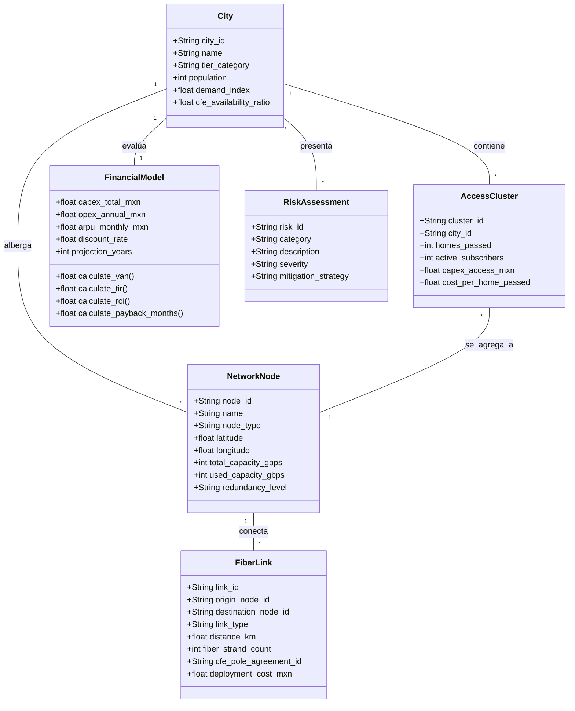

# Modelo de Dominio de Telecomunicaciones — SOMOS Internet

**Proyecto**: Expansión Nacional de Red de Fibra Óptica (México)  
**Empresa**: SOMOS Internet  
**Entregable**: Domain_Model.md (Sprint 0)  

---

## 1. Diagrama de Dominio de Red y Negocio

---

## 2. Entidades Principales y Atributos

### 2.1 Ciudad (`City`)
Representa los nodos urbanos objetivo de expansión en México (**CDMX, Monterrey, Guadalajara, Tijuana, Mérida**).
- **Categoría Tier**: Tier 1 (Alta densidad / alta competencia), Tier 2 (Alto crecimiento / competencia moderada), Optimización (Red existente).
- **Índice de Demanda**: Score de 0 a 100 calculado a partir de penetración de banda ancha e ingreso promedio.
- **Disponibilidad CFE**: Porcentaje de postería CFE apta para adosamiento de fibra óptica.

### 2.2 Nodo de Red (`NetworkNode`)
Infraestructura física de conmutación y transporte.
- **Tipos**: `NATIONAL_POP`, `METRO_CORE`, `DISTRIBUTION_HUB`, `ACCESS_SPLITTER`.
- **Nivel de Redundancia**: `N+1`, `2N` (Doble anillo), `Unprotected`.

### 2.3 Tramo de Fibra (`FiberLink`)
Segmento físico de cable de fibra óptica (Backbone o Anillo Metro).
- **Tipos**: `BACKBONE_LONG_HAUL`, `METRO_RING`, `LAST_MILE_FEEDER`.
- **Hilos de Fibra**: Conteo de hilos (ej. 48, 96, 144, 288 hilos).
- **Convenio CFE**: Identificador de contrato y clave de permiso de adosamiento.

### 2.4 Bloque de Acceso / Casas Pasadas (`AccessCluster`)
Grupo de manzanas residenciales o parques industriales atendidos.
- **Casas Pasadas (Homes Passed)**: Unidades residenciales/comerciales a menos de 50 metros del cable de acceso.
- **Costo por Casa Pasada (Cost per Home Passed)**:
  $$\text{CPHP} = \frac{\text{CAPEX Acceso Última Milla}}{\text{Casas Pasadas}} \le \$500 \text{ MXN}$$

### 2.5 Modelo Financiero (`FinancialModel`)
Motor de cálculo de viabilidad económica.
- **Horizonte**: 5 años ($t = 1 \dots 5$).
- **Tasa de Descuento ($r$)**: Predeterminada en 7.5% (Ajustable dinámicamente).
- **Métricas Clave**: VAN, TIR / IRR, ROI, Payback (meses).

---

## 3. Reglas de Negocio Invariables (Invariants)

1. **Límite de Eficiencia de Acceso**:
   El Costo por Casa Pasada ($CPHP$) en clusters residenciales no debe exceder de **$500 MXN**. Si excede, la herramienta requerirá justificación comercial o densidad mínima de suscriptores.
2. **Redundancia Mínima en Backbone**:
   Todo nodo de Backbone Nacional debe pertenecer al menos a **2 rutas de enlace físicamente disjuntas** (Protección 1+1).
3. **Identificador Financiero**:
   Queda estrictamente prohibido el uso del término "VPN"; todas las funciones, variables y reportes emitirán **VAN** o **NPV**.
4. **Cumplimiento Normativo CFE**:
   Ningún tramo de fibra sobre postería de CFE puede exceder el límite de peso/tensión permitido por la norma de adosamiento CFE-PROT-2024.
