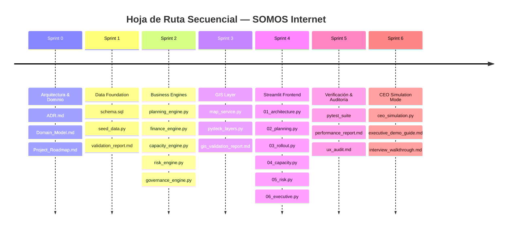

# Master Project Roadmap — SOMOS Internet

**Proyecto**: Expansión Nacional de Red de Fibra Óptica (México)  
**Empresa**: SOMOS Internet  
**Branding**: Incorporación de `Logo.gif` corporativo  
**Entregable**: Project_Roadmap.md (Sprint 0)  

---

## 🚀 Hoja de Ruta Ejecutiva por Sprints

---

## 📋 Detalle de Sprints, Entregables y Puertas de Calidad

### Sprint 0 — Architecture Definition (COMPLETADO / EN EVALUACIÓN)
- **Entregables**:
  1. [`ADR.md`](file:///c:/Users/diego/OneDrive/Documentos/Somos_Internet/ADR.md): Decisiones de topología (Backbone, Metro, Acceso), stack de datos (SQLite + Supabase), estándar financiero (VAN, TIR, ROI) y geografía (CDMX, MTY, GDL, TIJ, MID).
  2. [`Domain_Model.md`](file:///c:/Users/diego/OneDrive/Documentos/Somos_Internet/Domain_Model.md): Modelo conceptual de objetos, relaciones y reglas de negocio inviolables ($CPHP < \$500 \text{ MXN}$).
  3. [`Project_Roadmap.md`](file:///c:/Users/diego/OneDrive/Documentos/Somos_Internet/Project_Roadmap.md): Hoja de ruta master.
- **Subagente Evaluador**: `po_agent`
- **Puerta de Calidad**: Esperar Aprobación del Usuario.

---

### Sprint 1 — Data Foundation
- **Objetivo**: Establecer la estructura de base de datos relacional y geoespacial, con carga masiva de datos semilla para las 5 ciudades seleccionadas.
- **Entregables**:
  1. `schema.sql`: DDL optimizado en SQLite/PostgreSQL (PostGIS/GeoJSON ready).
  2. `seed_data.py`: Script de generación de nodos, tramos de fibra, convenios CFE, costos y suscriptores.
  3. `validation_report.md`: Reporte de validación de esquemas e integridad referencial.
- **Subagente Evaluador**: `qa_agent` + `po_agent`
- **Puerta de Calidad**: Esperar Aprobación del Usuario.

---

### Sprint 2 — Business Engines
- **Objetivo**: Desarrollar los 5 motores independientes de lógica de negocio en Python puro.
- **Entregables**:
  1. `planning_engine.py`: Algoritmo de priorización de inversión (Tier 1 vs Tier 2 vs Optimización).
  2. `finance_engine.py`: Cálculos de VAN (tasa 7.5% por defecto), TIR, ROI, Payback y costo por casa pasada ($CPHP$).
  3. `capacity_engine.py`: Utilización de hilos de fibra, capacidad de nodos y cálculo de redundancia 1+1.
  4. `risk_engine.py`: Matriz de riesgos (CFE, regulación, desastres, fallas de tramo) y puntuación de impacto.
  5. `governance_engine.py`: Cadencias de control, aprobaciones CAPEX y trazabilidad de proyectos.
- **Subagente Evaluador**: `qa_agent` + `po_agent`
- **Puerta de Calidad**: Esperar Aprobación del Usuario.

---

### Sprint 3 — GIS Layer
- **Objetivo**: Crear la capa de mapas interactivos geoespaciales para visualizar la topología de red nacional y urbana.
- **Entregables**:
  1. `map_service.py`: Servicio de carga y formateo de datos GeoJSON.
  2. `pydeck_layers.py`: Definición de capas PyDeck en 3D para tramos de Backbone, Anillos Metro, Nodos y Polígonos de Acceso.
  3. `gis_validation_report.md`: Reporte de rendimiento de renderizado GIS.
- **Subagente Evaluador**: `performance_agent` + `po_agent`
- **Puerta de Calidad**: Esperar Aprobación del Usuario.

---

### Sprint 4 — Streamlit Frontend
- **Objetivo**: Construir la interfaz de usuario dividida en 6 módulos temáticos integrando el branding de SOMOS Internet y `Logo.gif`.
- **Entregables**:
  1. `01_architecture.py`: Módulo de Arquitectura & Topología Nacional.
  2. `02_planning.py`: Módulo de Estrategia de Expansión & Trade-offs.
  3. `03_rollout.py`: Módulo Operativo de Despliegue & Permisos CFE.
  4. `04_capacity.py`: Módulo de Capacidad, Escalabilidad & Protocolo de Crisis (Falla 2h).
  5. `05_risk.py`: Módulo de Gobernanza & Matriz de Riesgos.
  6. `06_executive.py`: Dashboard Ejecutivo Integrado.
- **Subagente Evaluador**: `ux_ui_agent` + `po_agent`
- **Puerta de Calidad**: Esperar Aprobación del Usuario.

---

### Sprint 5 — Verification & Subagent Audit
- **Objetivo**: Auditoría técnica automatizada profunda mediante la ejecución coordinada de subagentes.
- **Entregables**:
  1. `pytest_suite`: Suite automatizada de pruebas unitarias e integración.
  2. `performance_report.md`: Tiempos de respuesta, hit ratio de caché y métricas de FPS en PyDeck.
  3. `ux_audit.md`: Auditoría de branding corporativo, layout y validación de `Logo.gif`.
- **Subagente Evaluador**: `qa_agent` + `performance_agent` + `ux_ui_agent` + `po_agent`
- **Puerta de Calidad**: Esperar Aprobación del Usuario.

---

### Sprint 6 — CEO Simulation Mode & Interview Delivery
- **Objetivo**: Módulo interactivo "Boardroom Simulation" para impresionar al entrevistador durante la demostración en vivo.
- **Entregables**:
  1. `ceo_simulation.py`: Sliders dinámicos para simulación teórica en tiempo real (CAPEX, OPEX, WACC/Tasa Descuento, Churn, ARPU).
  2. `executive_demo_guide.md`: Guía de navegación ejecutiva para la entrevista.
  3. `interview_walkthrough.md`: Guía de respuestas maestras a las 10 preguntas técnicas.
- **Subagente Evaluador**: `po_agent`
- **Puerta de Calidad**: Entrega Final.
