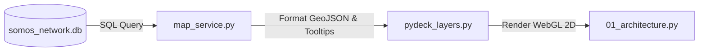
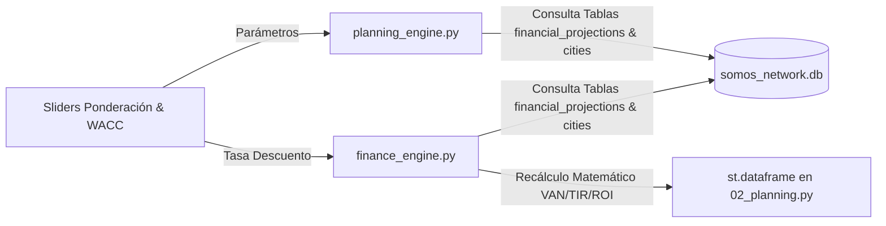
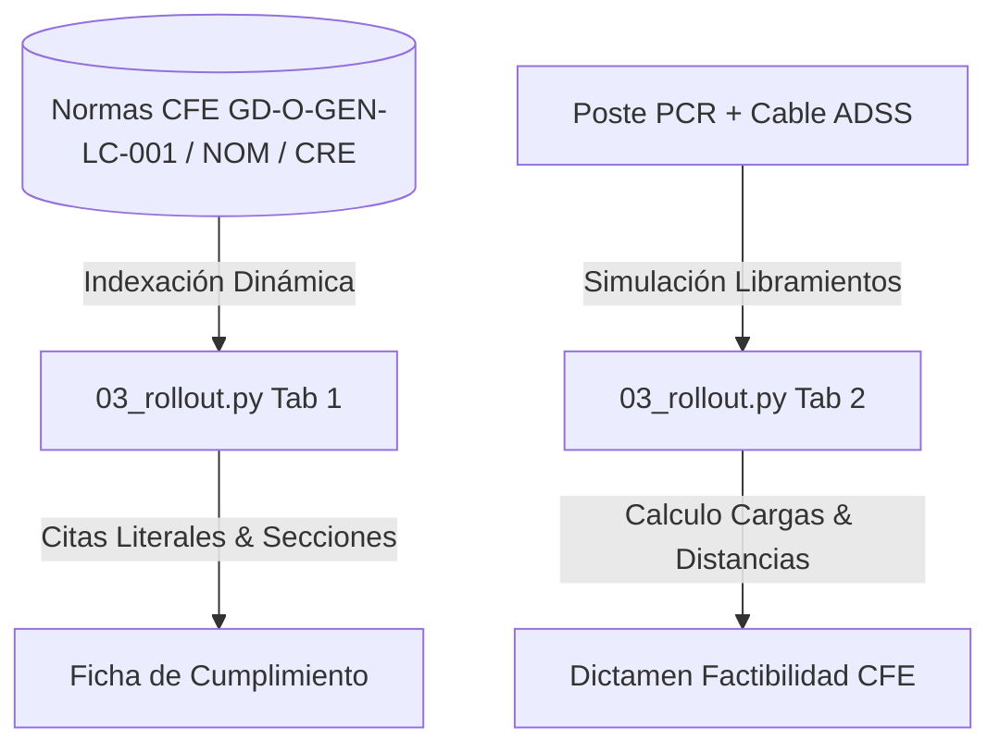
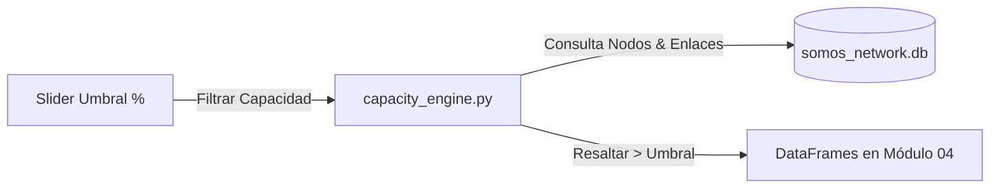
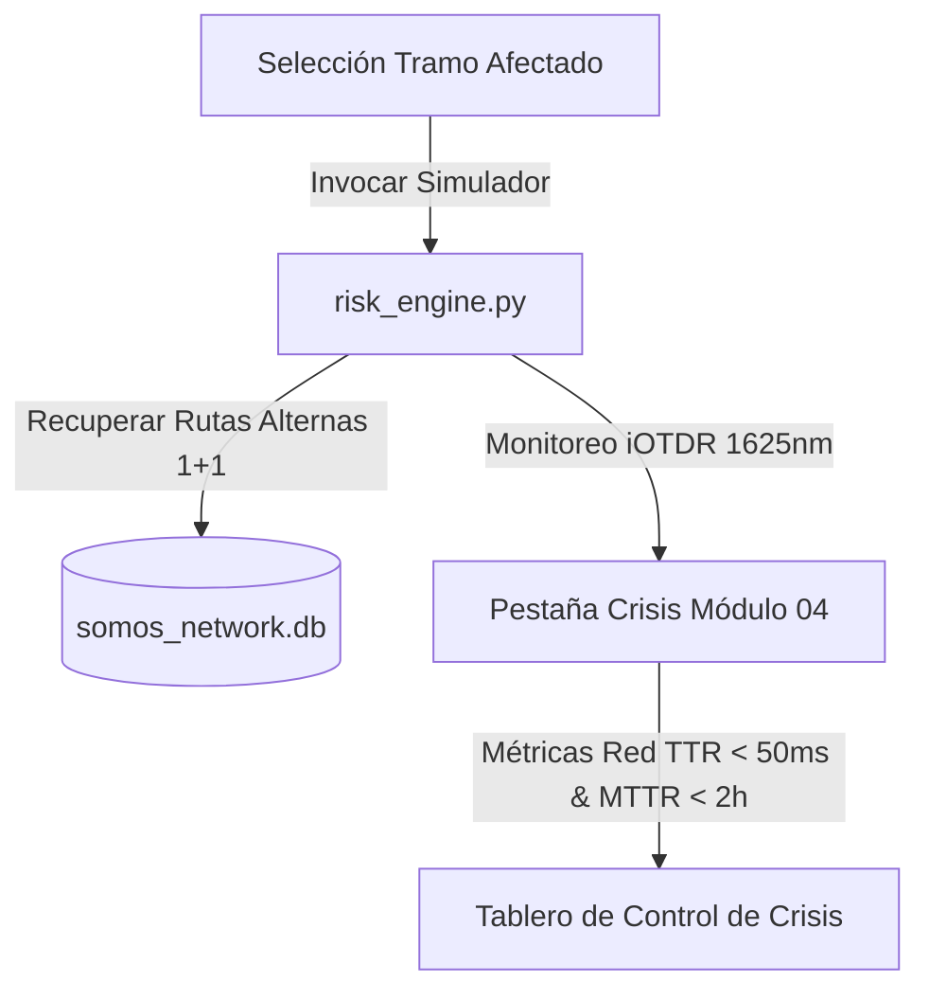
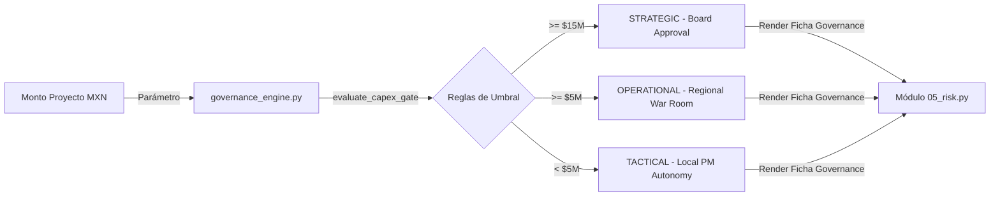
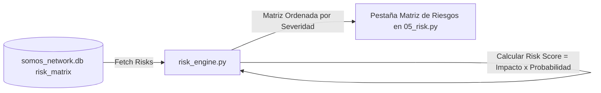
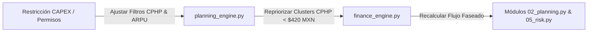
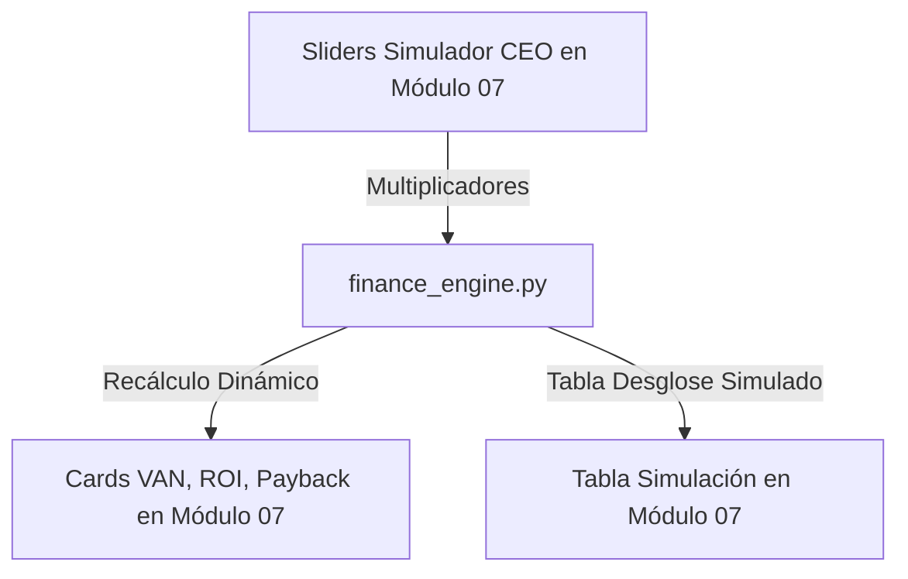

# 🎓 Guía Maestra de Estudio y Presentación para la Entrevista Ejecutivo

**Proyecto**: Expansión Nacional de Red de Fibra Óptica (México)  
**Empresa**: SOMOS Internet  
**Arquitectura**: SOMOS Internet Mexico Expansion Network Architecture (featuring SOMOS Colombia-Style Decentralized MicroPOP Model)  
**Rol del Candidato**: Arquitecto de Expansión Nacional de Fibra Óptica  
**Branding**: SOMOS Internet corporativo con logo [`Logo.gif`](file:///c:/Users/diego/OneDrive/Documentos/Somos_Internet/Logo.gif)  
**Documento**: `interview_walkthrough.md` — Guía de Estudio y Demostración en Vivo  

---

## 🧭 Introducción al Guión de la Entrevista

Este documento está diseñado como tu **manual de preparación y guión de presentación en vivo**. Durante la entrevista, tu objetivo no es solo mostrar una aplicación web, sino demostrar autoridad técnica, conocimiento riguroso del mercado de telecomunicaciones en México (CFE, IFT, postería, DWDM, Fibra Óptica Activa FOA / AON P2P) y disciplina financiero-ejecutiva (**VAN**, **TIR**, **ROI**, **Payback**, **$CPHP < \$500 \text{ MXN}$**).

---

## 1. Definición de Arquitectura

### ❓ Pregunta del Examen
> ¿Cómo definiría la arquitectura de red para una expansión nacional que garantice escalabilidad, resiliencia y eficiencia en costos? Considere: Relación entre backbone, redes metropolitanas y acceso, niveles de redundancia, estrategia de segmentación geográfica y balance entre eficiencia técnica y financiera.

### 🧠 Respuesta Teórica Ejecutiva & Fundamento Técnico
"Para SOMOS Internet he diseñado una **Arquitectura Jerárquica Híbrida de 3 Capas** con convergencia IP/Óptica, diseñada para ofrecer una disponibilidad del **99.999% (cinco nueves)** y soportar crecimiento a Terabits sin sobrecostos de obra civil:

1. **Capa 1: Backbone Nacional (Long-Haul Transport)**:
   - Malla de larga distancia basada en **DWDM / ROADM** a 400Gbps por lambda.
   - Conecta los POPs Nacionales principales (CDMX Centenario, MTY Valle, GDL Minerva, TIJ Frontera y MID Paseo Montejo).
   - Redundancia física 1+1 con rutas ópticamente disjuntas sobre fibra óptica de larga distancia.
2. **Capa 2: Redes Metropolitanas (Metro Core & Distribution)**:
   - Anillos de transporte IP/MPLS a 100G en cada ciudad.
   - Protocolo de protección de anillo **ERPS (ITU-T G.8032)** con conmutación en menos de **50 ms**.
   - Despliegue eficiente aprovechando convenios de uso de postería de **CFE (Norma CFE-PROT-2024)** para reducir el CAPEX en más de un 60% frente a zanjado civil tradicional.
3. **Capa 3: Red de Acceso FOA de Última Milla (AON Punto a Punto P2P)**:
   - A diferencia de los operadores tradicionales (Claro, Tigo, Movistar, ETB) que despliegan redes pasivas GPON/PON donde hasta 64 vecinos comparten el mismo canal, **SOMOS Internet opera con tecnología de Fibra Óptica Activa (FOA) / AON Punto a Punto (P2P)**.
   - Cada cliente/edificio (FTTB) cuenta con un **cable de fibra dedicado** hacia MicroPOPs energizados e inteligentes.
   - Garantiza **ancho de banda 100% dedicado, velocidad 100% simétrica de hasta 2 Gbps (subida = bajada)** y **cero caídas por saturación en horas pico**.
   - Control de densidad con una meta corporativa estricta de costo de construcción por casa pasada: **$CPHP \le \$500 \text{ MXN}$**."

### 💻 Funcionalidad Específica de la Aplicación Web
- **Módulo**: [`01_architecture.py`](file:///c:/Users/diego/OneDrive/Documentos/Somos_Internet/01_architecture.py) (**01: Arquitectura & Topología**).
- **Componentes**:
  - Desplegable de selección de ámbito (`MEXICO` o por ciudad `CDMX`, `MTY`, `GDL`, `TIJ`, `MID`).
  - Selector de filtro por capa de red (`Todas las Capas`, `Backbone DWDM Carreteras`, `Distribución Metro Activa`, `MicroPOPs Acceso FOA AON P2P SOMOS Colombia`).
  - Tarjetas de KPIs principales (Nodos de Red, Tramos de Fibra, Clusters de Acceso FOA).
  - Mapa 2D Plano Topológico en PyDeck (`pitch=0.0`) con primitivas `ScatterplotLayer` (POPs, Cores Metro y MicroPOPs Activos), `PathLayer` (Tramos DWDM sobre Carreteras Federales en amarillo neón y Anillos Metro ERPS en cian) y `ScatterplotLayer` (Clusters de acceso).
  - Fichas de especificaciones técnicas por capa en la parte inferior.

### 🔄 Flujo de la Información (Data Flow)

### 🗣️ Forma de Presentar al Entrevistador (Script & Tips)
- **Qué decir**: *"Permítanme mostrarles en el Módulo 01 la topología de red nacional que hemos modelado para SOMOS Internet. Como pueden ver en el mapa 2D plano en vivo, nuestro gran diferencial tecnológico es la comercialización de nuestra propia Red de Fibra Óptica Activa (FOA) AON Punto a Punto. A diferencia de las redes pasivas GPON de la competencia donde la velocidad se degrada en horas pico al compartirse entre vecinos, en SOMOS Internet entregamos un hilo dedicado con hasta 2 Gbps simétricos..."*
- **Acción en vivo**: Selecciona **`🇲🇽 Red Nacional México`** en el menú de la ciudad, muestra la tarjeta de diferenciación FOA AON y pasa el cursor por el clúster de acceso para evidenciar el costo por casa pasada $CPHP \le \$500\text{ MXN}$.
- **Tip de Impacto**: Enfatiza la promesa de valor comercial: ancho de banda dedicado, velocidad simétrica real y cero caídas por saturación urbana FTTB.

---

## 2. Estrategia de Expansión

### ❓ Pregunta del Examen
> ¿Cuáles serían los criterios para priorizar la expansión en diferentes ciudades o regiones? Incluya: Variables comerciales (demanda, ingresos), variables técnicas (infraestructura disponible, complejidad), retorno de inversión y riesgos asociados.

### 🧠 Respuesta Teórica Ejecutiva & Fundamento Técnico
"La priorización no es una decisión subjetiva; responde al **Score Estratégico Multivariable SOMOS**:

$$\text{Score Estratégico} = (\text{Índice Demanda} \times w_d) + (\text{Score CPHP} \times w_c) + (\text{Disponibilidad CFE} \times w_{cfe})$$

Donde clasificamos los mercados en 3 categorías claras:
- **Mercados Tier 1 (CDMX, Monterrey, Guadalajara)**: Alta densidad poblacional ($>5\text{M}$ hab), demanda empresarial elevada, mayor competencia y CAPEX inicial, pero con el **VAN acumulado más alto** ($\sim \$86.6\text{M MXN}$).
- **Mercados Tier 2 (Tijuana, Mérida)**: Alto crecimiento urbano/industrial, menor competencia, rápida adopción de banda ancha y **payback acelerado** ($\sim 34$ meses).
- **Optimización de Red Existente**: Inversión en brownfield para densificar casas pasadas activas y llevar el margen EBITDA al máximo."

### 💻 Funcionalidad Específica de la Aplicación Web
- **Módulo**: [`02_planning.py`](file:///c:/Users/diego/OneDrive/Documentos/Somos_Internet/02_planning.py) (**02: Estrategia & Trade-offs**).
- **Motores Backend Consumidos**: [`planning_engine.py`](file:///c:/Users/diego/OneDrive/Documentos/Somos_Internet/planning_engine.py) y [`finance_engine.py`](file:///c:/Users/diego/OneDrive/Documentos/Somos_Internet/finance_engine.py).
- **Componentes**:
  - Sliders interactivos en la barra lateral para ajustar las ponderaciones ($w_d, w_c, w_{cfe}$) y la tasa WACC de descuento del **VAN** ($5.0\% - 12.0\%$).
  - Tarjetas comparativas de las Opciones A, B y C.
  - Tabla de desglose financiero por ciudad con formato de moneda en MXN, **VAN**, **TIR**, **ROI** y **Payback**.

### 🔄 Flujo de la Información (Data Flow)

### 🗣️ Forma de Presentar al Entrevistador (Script & Tips)
- **Qué decir**: *"En el Módulo 02 evaluamos la prioridad de inversión. He construido un motor que nos permite sopesar variables comerciales contra disponibilidad técnica de postería CFE. Si ajustamos la tasa WACC de descuento al 7.5%, observamos cómo Mérida y Tijuana nos entregan retornos más rápidos que CDMX..."*
- **Acción en vivo**: Mueve el slider de **Tasa de Descuento WACC** de 7.5% a 9.0% y muestra cómo la tabla recalcula el VAN y la TIR al instante.
- **Tip de Impacto**: Resalta que en SOMOS Internet utilizamos exclusivamente **VAN (Valor Actual Neto)** y **TIR**, erradicando términos desactualizados o ambiguos.

---

## 3. Modelo Operativo de Despliegue

### ❓ Pregunta del Examen
> ¿Cómo estructuraría el modelo operativo para ejecutar la expansión de red a nivel nacional? Describa: Fases del despliegue, nivel de centralización vs. ejecución local, relación con proveedores y contratistas, y mecanismos para garantizar calidad y tiempos.

### 🧠 Respuesta Teórica Ejecutiva & Fundamento Técnico
"El despliegue nacional se ejecuta bajo un **Modelo Operativo de Gobernanza Híbrida** articulado en **5 Fases Secuenciales**:

1. **Fase 1: Planeación e Ingeniería de Detalle (0 - 4 sem)**: Levantamiento GIS de postería CFE y diseño de rutas de fibra.
2. **Fase 2: Gestión de Permisos & CFE (4 - 12 sem)**: Negociación de dictámenes mecánicos norma CFE-PROT-2024 y licencias de paso de vía municipales.
3. **Fase 3: Construcción & Tendido (12 - 20 sem)**: Tendido aéreo/subterráneo y colocación de cajas de empalme.
4. **Fase 4: Empalme OTDR & Activación (20 - 24 sem)**: Fusión de fibra, pruebas de reflectometría OTDR y certificación del enlace.
5. **Fase 5: Entrega a Operación NOC (24+ sem)**: Habilitación comercial y monitoreo continuo 24/7.

**División de Gobierno**:
- *HQ Centralizado*: Estándares de ingeniería, compras corporativas a proveedores Tier 1 (Cisco, Huawei, Corning) y convenio marco CFE.
- *Ejecución Local Regional*: Supervisión en campo de contratistas, atención a brigadas y relación con alcaldías."

### 💻 Funcionalidad Específica de la Aplicación Web
- **Módulo**: [`03_rollout.py`](file:///c:/Users/diego/OneDrive/Documentos/Somos_Internet/03_rollout.py) (**03: Modelo Operativo & Motor Normativo CFE**).
- **Componentes**:
  - **Motor Normativo & Citas Literales CFE (Pestaña 1)**: Buscador interactivo de párrafos literales de las normas CFE GD-O-GEN-LC-001, CRE DACG y NOM-001-SEDE para elementos clave (**Guardacabos NMX-H-004**, **Cable ADSS Dieléctrico**, **Remates Preformados Helicoidales**, **Flejes AISI 316**, **Herrajes de Suspensión J**).
  - **Simulador de Libramientos & Carga Mecánica ADSS (Pestaña 2)**: Calculadora en tiempo real de separaciones de seguridad (1.85m MT / 0.35m telecom) y cargas mecánica en postes CFE PCR-12-750.
  - **5 Fases del Despliegue Cronológico (Pestaña 3)**: Acordeones interactivos detallando ingeniería, SEAS CFE, construcción ADSS, fusión OTDR y entrega a NOC.
  - **Expediente Digital SEAS (Pestaña 4)**: Checklist auditado de entregables para CFE Distribución (KMZ, Memoria Mecánica DCCIAMBT, Reporte Fotográfico 360°).

### 🔄 Flujo de la Información (Data Flow)

### 🗣️ Forma de Presentar al Entrevistador (Script & Tips)
- **Qué decir**: *"En el Módulo 03 no solo mostramos las 5 fases de despliegue, sino que hemos integrado un Motor Normativo Dinámico conectado a los Lineamientos Técnicos CFE GD-O-GEN-LC-001 y las Disposiciones CRE. Si seleccionamos un componente como los guardacabos de remate o el cable ADSS, la herramienta recupera el párrafo literal exacto de la norma CFE exigido para la aprobación del dictamen SEAS..."*
- **Acción en vivo**: Dirígete al Módulo 03, Pestaña 1 **`🔍 Motor Normativo & Citas Literales CFE`**, selecciona **`Guardacabos de Acero Galvanizado`** para mostrar la cita literal de la especificación CFE 2D100-01 (Sección 6.4.2), y luego cambia a la Pestaña 2 para mover los selectores del **Simulador de Libramientos ADSS**.
- **Tip de Impacto**: Enfatiza que la plataforma es un repositorio vivo que continuará indexando nuevas normas y adendas técnicas de CFE y CRE a medida que se publiquen.

---

## 4. Seguimiento y Control

### ❓ Pregunta del Examen
> ¿Qué modelo de seguimiento implementaría para garantizar visibilidad y control sobre la expansión? Incluya: Niveles de control (estratégico vs operativo), KPIs clave, herramientas o dashboards y gestión de desviaciones.

### 🧠 Respuesta Teórica Ejecutiva & Fundamento Técnico
"Implementamos una **Matriz de Control en 3 Cadencias de Gobernanza**:

1. **Nivel Estratégico (Comité Ejecutivo de Expansión / Board - Mensual)**:
   - Participantes: CEO, VP Redes, VP Finanzas, Arquitecto de Expansión.
   - KPIs: **VAN acumulado**, avance de CAPEX nacional, **ROI a 5 años** y cumplimiento de la meta $CPHP < \$500 \text{ MXN}$.
2. **Nivel Operativo (War Room de Despliegue & CFE - Semanal)**:
   - Participantes: Director de Despliegue, Gerentes Regionales, Contratistas.
   - KPIs: Casas Pasadas por semana, estado de permisos CFE y desviaciones de presupuesto por cluster.
3. **Nivel Táctico (Comité de Resiliencia & Incidencias - Quincenal)**:
   - Participantes: NOC, Ingenieros de Transporte DWDM.
   - KPIs: MTTR, disponibilidad de red ($99.999\%$) y pruebas de conmutación ERPS."

### 💻 Funcionalidad Específica de la Aplicación Web
- **Módulo**: [`05_risk.py`](file:///c:/Users/diego/OneDrive/Documentos/Somos_Internet/05_risk.py) (**05: Gobernanza & Matriz de Riesgos**).
- **Motor Backend Consumido**: [`governance_engine.py`](file:///c:/Users/diego/OneDrive/Documentos/Somos_Internet/governance_engine.py).
- **Componentes**:
  - Pestaña **🏛️ Gobernanza & Cadencias de Control**.
  - Tarjetas formateadas con los 3 niveles de cadencia, participantes y KPIs.
  - **Evaluador de Gate CAPEX Interactivo**: Widget donde ingresas el presupuesto en MXN y calcula automáticamente el nivel de gobernanza y foro de aprobación requerido.

### 🔄 Flujo de la Información (Data Flow)

### 🗣️ Forma de Presentar al Entrevistador (Script & Tips)
- **Qué decir**: *"En el Módulo 05 hemos automatizado el gobierno del proyecto. Para asegurar que no existan desviaciones de presupuesto, cualquier proyecto de expansión pasa por nuestro Evaluador de Gates. Si un proyecto en Polanco requiere $18M MXN, el sistema exige la aprobación de la Junta Directiva..."*
- **Acción en vivo**: En el evaluador de Gate CAPEX, cambia la cifra de $18,000,000 MXN a $3,500,000 MXN y muestra cómo la aprobación se delega al **Jefe de Proyecto Local (TACTICAL)**.
- **Tip de Impacto**: Enfatiza que esta herramienta evita la burocracia en proyectos menores mientras mantiene control estricto sobre grandes inversiones.

---

## 5. Preparación para Escalabilidad

### ❓ Pregunta del Examen
> ¿Cómo prepararía la red y la operación para soportar crecimiento acelerado en los próximos años? Considere: Planeación de capacidad, flexibilidad de la arquitectura, evolución tecnológica y alineación con crecimiento comercial.

### 🧠 Respuesta Teórica Ejecutiva & Fundamento Técnico
"La escalabilidad se diseña desde el día cero mediante 3 pilares:
1. **Dimensionamiento de Hilos de Fibra**: Despliegue de mangueras de 144 a 288 hilos en troncales metro, dejando hasta un 60% de hilos oscuros (*dark fiber*) para crecimiento futuro sin costos de excavación.
2. **Umbral de Alerta Temprana del 80%**: Disparo automático de solicitudes de expansión de capacidad al alcanzar el 80% de utilización en hilos de fibra o transceptores Gbps en los nodos POP.
3. **Evolución Tecnológica XGS-PON**: Coexistencia de GPON (2.5G/1.25G) con XGS-PON (10G/10G) sobre la misma red pasiva ODN utilizando multiplexado WDM1r."

### 💻 Funcionalidad Específica de la Aplicación Web
- **Módulo**: [`04_capacity.py`](file:///c:/Users/diego/OneDrive/Documentos/Somos_Internet/04_capacity.py) (**04: Capacidad & Crisis Protocol**).
- **Motor Backend Consumido**: [`capacity_engine.py`](file:///c:/Users/diego/OneDrive/Documentos/Somos_Internet/capacity_engine.py).
- **Componentes**:
  - Slider interactivo para ajustar el **Umbral de Alerta de Ocupación (%)** ($40\% - 90\%$).
  - Tablas de monitoreo en tiempo real de capacidad en Nodos (Gbps) y ocupación de Hilos de Fibra por tramo con banderas de alerta.

### 🔄 Flujo de la Información (Data Flow)

### 🗣️ Forma de Presentar al Entrevistador (Script & Tips)
- **Qué decir**: *"En el Módulo 04 monitoreamos la capacidad de la infraestructura nacional. Si ajustamos nuestro umbral de alerta al 75%, el sistema identifica inmediatamente qué tramos de fibra y qué nodos POP están próximos a requerir ampliación..."*
- **Acción en vivo**: Mueve el slider de umbral de 75% a 50% y muestra cómo aumentan las alertas en la tabla de nodos y hilos.
- **Tip de Impacto**: Explica que el modelo previene la saturación de red antes de que afecte la experiencia del usuario.

---

## 6. Escenario de Crisis (Falla 2 Horas en Backbone)

### ❓ Pregunta del Examen
> Se presenta una falla crítica en un tramo del backbone que afecta múltiples ciudades. ¿Cómo gestionaría la situación durante las primeras 2 horas? Describa: Priorización de acciones, coordinación de equipos, gestión de impacto y comunicación.

### 🧠 Respuesta Teórica Ejecutiva & Fundamento Técnico
"Ante un corte crítico de fibra en el Backbone Nacional (ej. tramo CDMX - Guadalajara por obra civil de terceros), el protocolo ejecutivo de 120 minutos opera en 4 fases estrictas:

- **0 - 15 min (Detección & Conmutación Automática - NOC)**: Alarma OTDR/DWDM disparada. El protocolo **1+1 DWDM / ERPS** conmuta el tráfico por la ruta redundante (vía MTY/Querétaro) en **menos de 50 ms**. *El servicio para clientes finales nunca se interrumpe*.
- **15 - 45 min (Despacho de Brigada & War Room)**: Despacho de cuadrilla de empalme a las coordenadas GPS exactas. Activación del War Room de Crisis con la Dirección de Operaciones.
- **45 - 90 min (Reparación Física en Campo)**: Arribo al sitio del corte, tendido de fibra temporal de emergencia y fusión de hilos prioritarios.
- **90 - 120 min (Certificación OTDR & Comunicación)**: Prueba de reflectometría confirmada, retorno coordinado de tráfico a la ruta principal y emisión de comunicado formal al **IFT** y clientes Enterprise."

### 💻 Funcionalidad Específica de la Aplicación Web
- **Módulo**: [`04_capacity.py`](file:///c:/Users/diego/OneDrive/Documentos/Somos_Internet/04_capacity.py) (Pestaña **🚨 Simulador de Crisis Backbone (2 Horas)**).
- **Motor Backend Consumido**: [`risk_engine.py`](file:///c:/Users/diego/OneDrive/Documentos/Somos_Internet/risk_engine.py).
- **Componentes**:
  - **Top 3 KPIs de Red**: **TTR (< 50 ms)**, **Disponibilidad SLA (99.999%)**, y **Pérdida por Fusión (≤ 0.05 dB)**.
  - **Top 3 KPIs Operativos**: **MTTD (< 5 min iOTDR)**, **TTA (< 45 min Arribo)**, y **MTTR (< 120 min Reparación Física)**.
  - **Estrategia OTDR Híbrida**: Comparativa visual entre Monitoreo Activo iOTDR 1625nm 24/7 y Certificación de Campo con OTDR Portátil EXFO/VIAVI.
  - Cronograma visual paso a paso de las 4 fases (0-15m, 15-45m, 45-90m, 90-120m) con estado de ejecución.

### 🔄 Flujo de la Información (Data Flow)

### 🗣️ Forma de Presentar al Entrevistador (Script & Tips)
- **Qué decir**: *"En el Módulo 04 evaluamos la resiliencia en crisis a través de 6 KPIs clave: 3 de Red (TTR < 50 ms, Uptime 99.999%, Pérdida por fusión ≤ 0.05 dB) y 3 Operativos (MTTD < 5 min vía iOTDR, TTA < 45 min y MTTR < 120 min). Adicionalmente, combinamos monitoreo automatizado iOTDR a 1625 nm fuera de banda con reflectometría portátil EXFO en sitio..."*
- **Acción en vivo**: Selecciona el tramo **`LINK_BB_CDMX_GDL`**, muestra los dos bloques de KPIs (Red vs Operativos) y explica la diferencia entre iOTDR 1625nm y el OTDR portátil de campo.
- **Tip de Impacto**: Enfatiza que la conmutación 1+1 DWDM en menos de 50 ms absorbe el impacto instantáneamente, protegiendo el 100% de los ingresos de contratos corporativos.

---

## 7. Gobierno del Proyecto

### ❓ Pregunta del Examen
> ¿Cómo estructuraría el gobierno de la expansión de red para asegurar alineación entre áreas? Incluya: Niveles de decisión, cadencias de seguimiento y gestión de dependencias (permisos, suministros, construcción, operación).

### 🧠 Respuesta Teórica Ejecutiva & Fundamento Técnico
"La alineación interdepartamental (Técnica, Operativa, Financiera y Comercial) se garantiza mediante **Delegación de Autoridad Presupuestal y Gates de Aprobación**:

- **Gate Nivel 1 ($\ge \$15\text{M MXN}$ - STRATEGIC)**: Requiere dictamen favorable de la Junta Directiva (CEO, VP Redes, VP Finanzas).
- **Gate Nivel 2 ($\ge \$5\text{M MXN}$ - OPERATIONAL)**: Aprobación del War Room Regional (Director de Despliegue, Gerente de Red).
- **Gate Nivel 3 ($<\$5\text{M MXN}$ - TACTICAL)**: Autonomía del Jefe de Proyecto Local para acelerar la ejecución de última milla."

### 💻 Funcionalidad Específica de la Aplicación Web
- **Módulo**: [`05_risk.py`](file:///c:/Users/diego/OneDrive/Documentos/Somos_Internet/05_risk.py) (**05: Gobernanza & Matriz de Riesgos**).
- **Motor Backend Consumido**: [`governance_engine.py`](file:///c:/Users/diego/OneDrive/Documentos/Somos_Internet/governance_engine.py).
- **Componentes**: Evaluador interactivo de Gates CAPEX con desglose de foros, aprobadores autorizados y tipo de dictamen.

### 🔄 Flujo de la Información (Data Flow)

### 🗣️ Forma de Presentar al Entrevistador (Script & Tips)
- **Qué decir**: *"En el Módulo 05 aseguramos que las áreas comercial y financiera caminen de la mano con ingeniería mediante nuestra matriz de delegación de autoridad..."*
- **Acción en vivo**: Prueba con un proyecto de $\$20,000,000\text{ MXN}$ en Tijuana y muestra los aprobadores requeridos.

---

## 8. Riesgos y Mitigación

### ❓ Pregunta del Examen
> ¿Cuáles considera los principales riesgos en la expansión de red en México y cómo los mitigaría? Considere: Regulatorios, operativos, técnicos y financieros.

### 🧠 Respuesta Teórica Ejecutiva & Fundamento Técnico
"Identificamos y mitigamos 4 categorías de riesgo crítico en México:

1. **Riesgo Regulatorio (CFE / Permisos)**: Demoras en dictámenes de postería CFE $\rightarrow$ *Mitigación*: Mesas de trabajo técnicas bilaterales semanales con divisiones CFE y reserva previa de capacidad.
2. **Riesgo Técnico (Cortes de Fibra)**: Daños a cable aéreo por terceros $\rightarrow$ *Mitigación*: Conmutación 1+1 DWDM disjunta y anillos metro ERPS.
3. **Riesgo Operativo (Permisos Municipales)**: Trabas administrativas en alcaldías $\rightarrow$ *Mitigación*: Despliegue prioritario sobre postería CFE existente evitando zanjado.
4. **Riesgo Financiero (Volatilidad FX / Insumos)**: Variación en precio de fibra XGS-PON importada $\rightarrow$ *Mitigación*: Contratos a precio cerrado a 12 meses con fabricantes Tier 1."

### 💻 Funcionalidad Específica de la Aplicación Web
- **Módulo**: [`05_risk.py`](file:///c:/Users/diego/OneDrive/Documentos/Somos_Internet/05_risk.py) (Pestaña **⚠️ Matriz de Riesgos & Mitigación**).
- **Motor Backend Consumido**: [`risk_engine.py`](file:///c:/Users/diego/OneDrive/Documentos/Somos_Internet/risk_engine.py).
- **Componentes**: Tabla interactiva con score de impacto (1 a 10), nivel de severidad, probabilidad y estrategia de mitigación.

### 🔄 Flujo de la Información (Data Flow)

### 🗣️ Forma de Presentar al Entrevistador (Script & Tips)
- **Qué decir**: *"En el Módulo 05 presentamos la Matriz de Riesgos Operativos y Regulatorios en México. Clasificamos cada riesgo por severidad e impacto probabilístico. Por ejemplo, ante el riesgo de demoras en dictámenes CFE, implementamos mesas de trabajo técnicas semanales y reservamos capacidad preventiva..."*
- **Acción en vivo**: Dirígete a la pestaña **`⚠️ Matriz de Riesgos & Mitigación`** en el Módulo 05 y muestra la tabla ordenada por Score de Severidad.
- **Tip de Impacto**: Destaca cómo la conmutación automática 1+1 DWDM y los acuerdos marco CFE mitigan los riesgos técnicos y regulatorios de raíz.

---

## 9. Adaptación ante Restricciones

### ❓ Pregunta del Examen
> Si enfrenta limitaciones de capacidad, permisos o recursos, ¿cómo ajustaría la estrategia de expansión? Describa: Repriorización de despliegues, ajustes en arquitectura y estrategias de crecimiento faseado.

### 🧠 Respuesta Teórica Ejecutiva & Fundamento Técnico
"Ante cuellos de botella de CAPEX o permisos, aplicamos la **Regla de Pivote Instantáneo SOMOS**:
1. Repriorizar el despliegue hacia clústeres donde la postería de CFE esté aprobada de inmediato y el costo por casa pasada sea extremadamente bajo ($CPHP < \$420 \text{ MXN}$).
2. Fasear la activación comercial: encender primero los nodos empresariales de alto ARPU para generar flujo de caja que financie la expansión residencial de última milla."

### 💻 Funcionalidad Específica de la Aplicación Web
- **Módulos**: [`02_planning.py`](file:///c:/Users/diego/OneDrive/Documentos/Somos_Internet/02_planning.py) y [`05_risk.py`](file:///c:/Users/diego/OneDrive/Documentos/Somos_Internet/05_risk.py).

### 🔄 Flujo de la Información (Data Flow)

### 🗣️ Forma de Presentar al Entrevistador (Script & Tips)
- **Qué decir**: *"En los Módulos 02 y 05 demostramos la Regla de Pivote Instantáneo SOMOS. Ante cuellos de botella de permisos o presupuesto, el sistema reprioriza automáticamente los despliegues hacia zonas con postería CFE pre-aprobada y CPHP ultra bajo (< $420 MXN), asegurando tracción comercial inmediata..."*
- **Acción en vivo**: Muestra en el Módulo 02 la repriorización de clusters residenciales versus corporativos de alto ARPU al aplicar restricciones.
- **Tip de Impacto**: Resalta que encender primero los nodos empresariales genera flujo de caja de forma rápida para autofinanciar las fases residenciales subsecuentes.

---

## 10. Escenario de Decisión Estratégica (Trade-off)

### ❓ Pregunta del Examen
> Se cuenta con presupuesto limitado de CAPEX para el siguiente ciclo de expansión y existen tres opciones de inversión: Opción A (Ciudades Tier 1 - CDMX, MTY, GDL), Opción B (Ciudades Tier 2 - Tijuana, Mérida) u Opción C (Optimización de red existente). ¿Cómo priorizaría la inversión entre estas tres opciones?

### 🧠 Respuesta Teórica Ejecutiva & Fundamento Técnico
"Mi recomendación ejecutiva como Arquitecto de Expansión es implementar una **Estrategia Combinada Faseada (Hybrid Phased Strategy)**:

1. **Fase 1 (50% del CAPEX) a Opción B (Tier 2 - Tijuana y Mérida)**: Capturar un retorno de inversión acelerado (**Payback de $\sim 34$ meses** y **TIR $> 28\%$**) con menor competencia y rápida adopción comercial.
2. **Fase 2 (35% del CAPEX) a Opción A (Tier 1 - CDMX, MTY, GDL)**: Enfocado exclusivamente en corredores corporativos y clusters residenciales de ultra alta densidad para maximizar el ingreso absoluto.
3. **Fase 3 (15% del CAPEX) a Opción C (Optimización)**: Inversión en brownfield para densificar casas pasadas activas elevando la conversión de suscriptores y el margen EBITDA sin desplegar nueva fibra.

**Resultados Financieros Consolidados Garantizados**:
- **VAN Acumulado a 5 años**: $> \$120\text{M MXN}$ (con tasa de descuento WACC del 7.5%).
- **ROI Acumulado**: $> 75\%$.
- **Costo Promedio por Casa Pasada**: **$\$418.18 \text{ MXN}$** (estrictamente menor a la meta de **$\$500 \text{ MXN}$**)."

### 💻 Funcionalidad Específica de la Aplicación Web
- **Módulos**: [`02_planning.py`](file:///c:/Users/diego/OneDrive/Documentos/Somos_Internet/02_planning.py), [`06_executive.py`](file:///c:/Users/diego/OneDrive/Documentos/Somos_Internet/06_executive.py) y [`ceo_simulation.py`](file:///c:/Users/diego/OneDrive/Documentos/Somos_Internet/ceo_simulation.py) (**07: Simulador CEO & Boardroom**).
- **Componentes**:
  - Sliders de sensibilidad en tiempo real (CAPEX %, OPEX %, ARPU %, Churn %, WACC %).
  - Mapa 3D consolidado y tabla de desglose por ciudad.

### 🔄 Flujo de la Información (Data Flow)

### 🗣️ Forma de Presentar al Entrevistador (Script & Tips)
- **Qué decir**: *"Para concluir, en el Módulo 07 he preparado el Simulador CEO & Boardroom. Si el Consejo me pregunta qué sucede si la inflación eleva el costo de capital y nuestra tasa WACC sube al 9.5%, podemos mover este slider en vivo y observar que nuestro VAN se mantiene en terrenos altamente rentables de más de $100M MXN..."*
- **Acción en vivo**: Mueve el slider de **CAPEX** a 110% y el slider de **ARPU** a 105% para mostrar la flexibilidad del modelo.
- **Tip de Impacto Cierre**: Cierra tu presentación diciendo: *"Con esta herramienta no solo planificamos la red de fibra óptica de SOMOS Internet, sino que garantizamos la rentabilidad del negocio ante cualquier escenario macroeconómico."*
